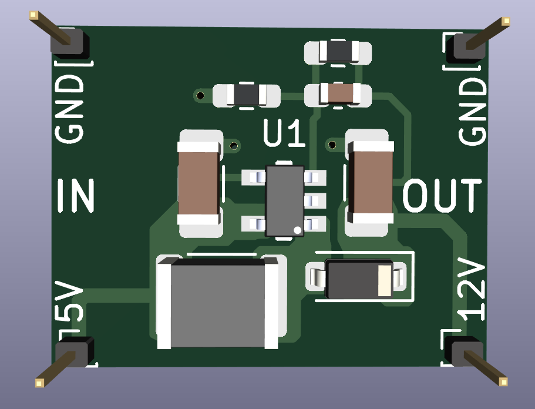
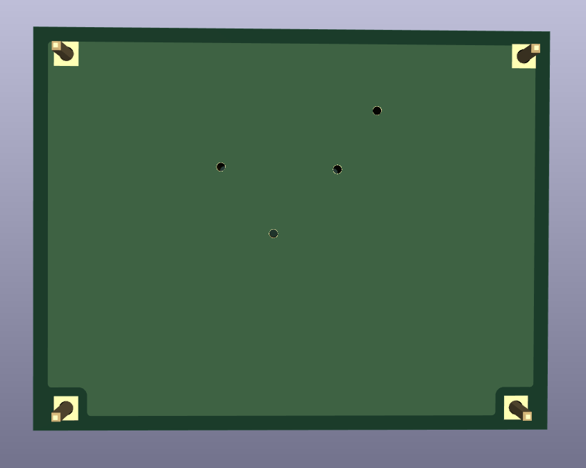
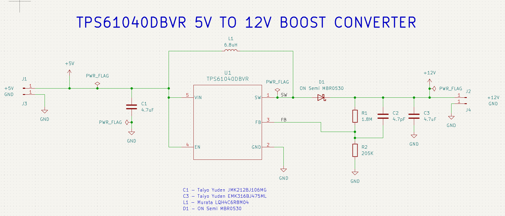
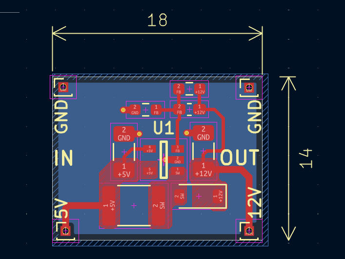

# TPS61040 5V to 12V DC-DC Boost Converter

A compact (18 mm × 14 mm) 2-layer DC-DC step-up converter module designed around the Texas Instruments **TPS61040** boost switching regulator. Converts a nominal 5 V input rail to a regulated 12 V output for low-power electronics, sensor supplies, and display bias networks.

---

## Technical Specifications

| Parameter | Value | Notes |
| :--- | :--- | :--- |
| **Input Voltage ($V_{IN}$)** | 5.0 V nominal | Operating range: 1.8 V to 6.0 V |
| **Output Voltage ($V_{OUT}$)** | 12.06 V nominal | Configured via precision feedback divider |
| **Switch Current Limit** | 400 mA (peak) | Internal switch rating |
| **Control Scheme** | Constant Peak Current PFM | Switch frequency up to 1 MHz |
| **Quiescent Current** | 28 µA | Typical operating $I_Q$ |
| **Board Dimensions** | 18.0 mm × 14.0 mm | Dual-layer 1.6 mm FR4 |

---

## Visuals & Renders

### 3D Model Renders

| Top View | Bottom View |
| :---: | :---: |
|  |  |

---

## Schematic Design

### Circuit Details

1. **Feedback Network Calculation**:
   The output voltage is set using an internal reference voltage of $V_{FB} = 1.233\text{ V}$:
   $$V_{OUT} = V_{FB} \times \left(1 + \frac{R_1}{R_2}\right)$$
   
   Using $R_1 = 1.8\text{ M}\Omega$ and $R_2 = 205\text{ k}\Omega$:
   $$V_{OUT} = 1.233\text{ V} \times \left(1 + \frac{1,800,000}{205,000}\right) = 12.058\text{ V}$$

2. **Feedforward Compensation ($C_2$)**:
   A $4.7\text{ pF}$ ceramic capacitor ($C_2$) in parallel with $R_1$ compensates for parasitic capacitance at the high-impedance `FB` node, suppressing switching ripple and stabilizing the feedback loop.

3. **Power Stage Components**:
   - **Inductor ($L_1$)**: Murata LQH4C6R8M04 ($6.8\ \mu\text{H}$, $1812$ package). Chosen for low DC resistance and sufficient saturation current above the 400 mA switch limit.
   - **Rectifier Diode ($D_1$)**: ON Semiconductor MBR0530 Schottky diode ($30\text{ V}, 500\text{ mA}$, SOD-123). Low forward voltage drop ($V_F \approx 0.38\text{ V}$) maximizes power conversion efficiency.
   - **Filter Capacitors ($C_1, C_3$)**: $4.7\ \mu\text{F}$ 0805 MLCC capacitors for input decoupling and output ripple attenuation.

---

## PCB Layout & Design Considerations

* **Physical Dimensions**: 18.0 mm × 14.0 mm with standard 2.54 mm (100 mil) pin headers for input, output, and ground test points.
* **Switching Loop Minimization**: Pin 1 (`SW`), Inductor $L_1$, and Diode $D_1$ are placed tightly adjacent to reduce high $di/dt$ loop area and limit radiated Electromagnetic Interference (EMI).
* **Feedback Guarding**: Feedback resistor divider ($R_1, R_2$) and compensation capacitor ($C_2$) are located in close proximity to Pin 3 (`FB`). The feedback trace taps off downstream of output capacitor $C_3$ to avoid sensing high-frequency switching noise.

---

## Bill of Materials (BOM)

| RefDes | Qty | Value / Component | Package | Manufacturer | Part Number |
| :--- | :---: | :--- | :--- | :--- | :--- |
| **U1** | 1 | TPS61040 Boost Regulator IC | SOT-23-5 | Texas Instruments | `TPS61040DBVR` |
| **L1** | 1 | $6.8\ \mu\text{H}$ Power Inductor | 1812 / 4532 | Murata | `LQH4C6R8M04` |
| **D1** | 1 | $30\text{ V}, 500\text{ mA}$ Schottky Diode | SOD-123 | ON Semiconductor | `MBR0530` |
| **C1** | 1 | $4.7\ \mu\text{F}, 10\text{ V}$ X5R MLCC | 0805 | Taiyo Yuden | `JMK212BJ106MG` |
| **C3** | 1 | $4.7\ \mu\text{F}, 16\text{ V}$ X5R MLCC | 0805 | Taiyo Yuden | `EMK316BJ475ML` |
| **C2** | 1 | $4.7\text{ pF}, 50\text{ V}$ C0G MLCC | 0805 | Generic | — |
| **R1** | 1 | $1.8\text{ M}\Omega, 1\%$ Resistor | 0805 | Generic | — |
| **R2** | 1 | $205\text{ k}\Omega, 1\%$ Resistor | 0805 | Generic | — |
| **J1–J4** | 4 | 1-Pin Header (50 mil / 100 mil hole) | Through-hole | Generic | — |

